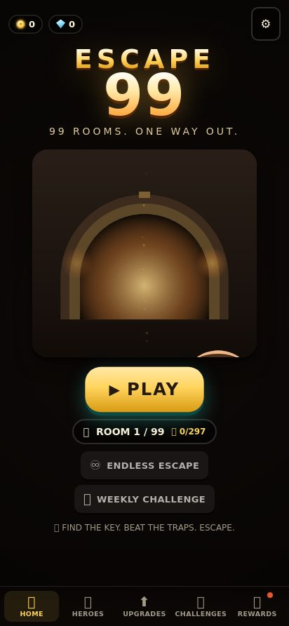
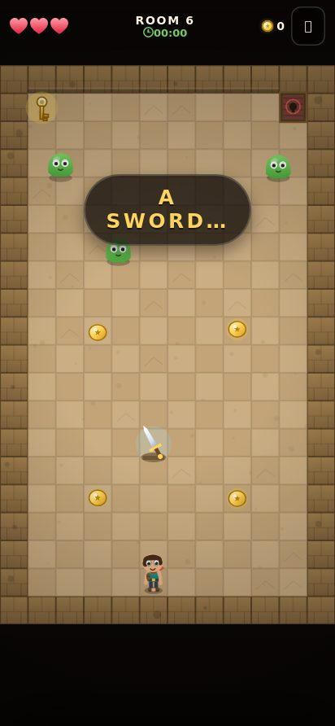
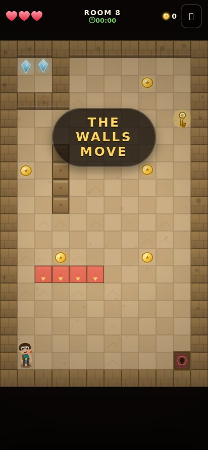
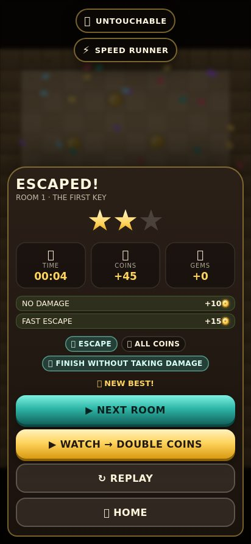

# ESCAPE 99 — 99 Rooms. One Way Out.

A portrait, one-thumb **puzzle-action escape game** that runs from a plain folder of
static files. No build step, no bundler, no CDN, no tracking servers. Open
`index.html` (or install the PWA) and play.

<p align="center">
  
  
  
  
</p>

<p align="center"><sub>Screenshots are generated from the real build by <code>node tools/smoke.mjs --tour</code>.</sub></p>

---

## Play it

| How | What to do |
| --- | --- |
| **Browser** | Open `index.html`. Chrome/Edge/Firefox/Safari all work. |
| **Local server** (recommended, needed for the service worker) | `npm start` → <http://localhost:8080> |
| **Phone** | `node tools/serve.mjs --host 0.0.0.0`, then open your computer's LAN IP on your phone. |
| **Install** | In Chrome/Safari: *Add to Home screen*. It launches full-screen, offline and instantly. |

### Controls (one thumb, always)

| Gesture | Action |
| --- | --- |
| **Swipe** any direction | one step (hold your thumb down to keep walking) |
| **Tap the on-screen button** | attack with the sword / use the current action |
| **Joystick mode** (optional, in Settings) | dragging anywhere moves Arin continuously |
| **Keyboard** (desktop/testing) | arrows/WASD to move, space to attack, `P` to pause |

Left-handed mode moves the action button to the other side.

---

## The loop

Every room asks one question: **“I understand what I need to do… so how do I get there?”**
Find the key, survive the traps, open the door. Rooms take 20–60 seconds and death
restarts in well under two seconds — most of the time it is one tap.

* 🗝️ **Key → exit.** The door is locked until the golden key is in your hand. Some rooms use a
  gate and two switches instead, and one room hands you a real choice: leave safely, or risk the chest.
* ⭐ **Three stars.** Escape · take every coin · clear the room challenge. Never forced, always worth it.
* 🪙 **Coins & 💎 gems** buy small, honest upgrades: an extra heart, a stronger blade, a dash,
  a treasure magnet, better luck. Nothing is ever gated behind a purchase.
* ♾️ **Endless Escape** — procedurally generated rooms that get meaner as you go, with a score.
* 🗓️ **Weekly Challenge** — the same dungeon for everyone, seeded by the ISO week number.

### Rooms 1–10 (World 1 — Forgotten Temple)

| # | Room | Teaches |
| --- | --- | --- |
| 1 | The First Key | swipe to move, key → exit |
| 2 | Watch Your Step | spike rhythm: the floor warns before it strikes |
| 3 | The Moving Guard | first enemy, gem hidden behind a secret door |
| 4 | Two Switches | switches + gate, and an optional 35-second star |
| 5 | Run From Fire | the key arms a fire wall that hunts you out |
| 6 | Sword Room | discover the blade, fight back |
| 7 | Treasure or Escape? | risk vs reward — the exit is free, the chest is not |
| 8 | The Maze Moves | walls that rearrange on a five-second beat |
| 9 | Everything Together | the exam: gates, slimes, spikes, a big chest |
| 10 | The Stone Guardian | boss with three patterns, then a lava escape |

89 more rooms and 9 more worlds are reserved by design (`ROOM_COUNT = 99`, ten themed
worlds in `src/data/themes.js`). Adding a room is a data-only change.

---

## Run the checks

```bash
npm test                       # 72 logic checks: every room solvable, every mechanic
npm run validate               # level-design validator (reachability, locks, i18n, fairness)
npm run check                  # both, in one go
node tools/smoke.mjs           # 22 real-browser checks in headless Chromium + screenshots
node tools/smoke.mjs --tour    # render every room and write docs screenshots
```

```
ESCAPE 99 — level validator
  #   ROOM                   WORLD             key  sw  gt  steps status
  1   THE FIRST KEY          FORGOTTEN TEMPLE    1   0   0     29 ok
  ...
  10  THE STONE GUARDIAN     FORGOTTEN TEMPLE    0   0   0     51 ok
  every room is escapable, complete and translated.
```

The **validator** builds the real `Room` objects and proves the things a human forgets:
sealed borders, one spawn, one exit, a key **XOR** a free exit (a room with neither is
unwinnable), switches that pair with gates, a reachable route through every pickup, no
moving wall that can sit on the spawn, every teaching line translated — twice — and a
fair escape window for the boss.

The **browser smoke test** proves the shell: boot with no console errors, a phone-sized
canvas that actually paints, the whole room framed on screen, pickups visible on the floor,
a real touch swipe moving Arin, every menu screen rendering, a full Hindi switch, a real
death and a retry timed against the two-second promise, an end-to-end escape, a
localStorage save and the service worker registering.

---

## Architecture

No framework, no bundler, no external requests. ES modules with a strict layering rule,
which is why the logic can be unit-tested in Node without a DOM:

```
index.html          canvas layers + the marketing/docs page
style.css           the whole design system
sw.js               offline shell cache (bump CACHE on release)
manifest.webmanifest installable PWA

src/core/           DOM-free logic — importable from Node
  util.js           seeded RNG, easings, BFS pathfinder, storage, el()
  i18n.js           t(), 10-language registry
  save.js           versioned save, migration, wallet/progress/stats, cloud-ready JSON
  analytics.js      local-only event log (400 events, never uploaded)
  challenges.js     daily + weekly challenges, achievements, goals
  ads.js            rewarded-video placeholder (optional, easily disabled)
src/data/           pure content: levels, strings, themes, progression, cosmetics
src/engine/         input (swipe/joystick/keyboard), WebAudio synth, particles, camera, haptics
src/game/           the simulation: room, entities, player, boss, endless, weekly, game orchestrator
src/render/         canvas drawing: Arin's rig (15 animations), the renderer
src/ui/             DOM screens, HUD, toasts, overlays
tools/              serve.mjs, validate-levels.mjs, smoke.mjs
tests/              the Node test suite (harness + rooms + systems)
docs/screens/       generated screenshots used by this README
```

**Performance.** One canvas, DPR capped at 2, the static floor painted once per room and
blitted afterwards, particles pooled, and a 60 FPS loop with a deliberate 30 FPS mode for
budget phones (Settings → Performance).

**Determinism.** Every room and every endless dungeon is generated from a seed, so a bug
report can be reproduced exactly (`save.data.stats.levelResults`, `endless` seeds).

---

## Localization

English and Hindi ship complete (**158 strings each**, EN + HI for every key), and the
architecture carries eight more Indian languages — Bengali, Tamil, Telugu, Marathi,
Gujarati, Kannada, Malayalam and Punjabi — already selectable in Settings, falling back
to English until a translation lands.

Gameplay needs almost no reading: teaching beats are short prompts with a visual rhythm,
numbered rooms, icon-driven HUD, and no text inside level logic. Everything a player reads
is a key in `src/data/strings.js`; add a table and the language is done.

---

## Accessibility

* colour is never the only signal — hazards are red **and** spiked **and** animated,
  blue is always safe, gold is always reward;
* **Vibration**, **Reduced screen shake**, **Left-handed** and **High-contrast hazards**
  toggles in Settings;
* `prefers-reduced-motion` is respected;
* 60/30 FPS switch for low-end devices;
* minimum 44 px touch targets, safe-area insets, portrait-only layout;
* no timed reading, prompts stay up while they matter, and every death explains itself.

## Privacy

Analytics are **local-only**: a capped event log on the device (`save.data.analytics`)
that powers the Challenges screen, the daily-goal ring, and Settings → *Export my data*
(a JSON download). Nothing is ever uploaded, no third-party script is loaded, and there
is no cookie. The named events (level_started, coin_collected, death_reason, …) are
documented in `src/core/save.js`.

## Monetization (placeholders, and honest ones)

* A **rewarded video** button appears only after an escape (`WATCH → DOUBLE COINS`) and on
  one death offer (`SECOND CHANCE`). Both are clearly labelled, purely optional, and every
  non-ad path works forever without them.
* `save.data.shop.adFree` removes the offers entirely (a real IAP hook goes here later).
* **No loot boxes, no gambling, no disguised ad buttons, no pay-to-win.** Upgrades are
  bought with coins you earned, and progression is never purchasable.

---

## Creativity beyond the brief

Small things added because they make the game feel made-by-a-person:

* **The whole room is hand-drawn in code.** There are no image assets at all — Arin's rig,
  the boss, every trap, the joinery in the floor tiles and the particle bursts are canvas
  paths. The entire game is well under a megabyte.
* **Everything has a story beat.** Teach prompts arrive as a rhythm (WAIT… GO for spikes),
  the slime squashes when it hops, the key floats up in slow motion, and the room names
  are little jokes ("Treasure or Escape?").
* **The boss is a puzzle, not a damage sponge.** The Guardian's charge can be dodged into a
  wall, which is the only window where your sword works — and then the room starts filling
  with lava while you run for the door.
* **A `--tour` mode.** `node tools/smoke.mjs --tour` renders all ten rooms and dumps
  screenshots, so a room can be reviewed visually in seconds.
* Currency glyphs are CSS shapes rather than emoji, so a coin looks like a coin on every
  device and in every language.

---

## Guides

**Add a room.** Append an object to `ROOMS` in `src/data/levels.js` (12×20 character
grid, legend at the top of the file), then run `npm run validate`. It will tell you if the
key is unreachable, if a moving wall parks on the spawn, if a teaching string is missing,
or if the exit is impossible to open.

**Add a language.** Copy the `en` table in `src/data/strings.js`, translate the values
(never the keys), and register the code in `SUPPORTED_LANGUAGES` in `src/core/i18n.js`.
Missing keys fall back to English, so a partial table is safe to ship.

**Ship a release.** Bump `CACHE` in `sw.js` (that is what makes updated installs pick up
new code) and the version in `package.json`, run `npm run check`, then
`node tools/smoke.mjs --tour` to refresh the screenshots. Point a Capacitor / Cordova /
WebView shell at `index.html` for an APK/IPA — portrait-locked, no external requests, no
tracking SDKs. Add your rewarded-ad adapter in `src/core/ads.js` behind the existing
`ads.watch(kind, onReward, opts)` interface; everything else already works without it.

## Roadmap

* Rooms 11–99 across worlds 2–10 (data only — `src/data/levels.js` + `npm run validate`)
* The eight remaining Indian language tables
* Real rewarded-video adapter behind `src/core/ads.js`'s existing interface
* Cloud saves (the save is already one JSON blob: `serialize()` / `deserialize()`)
* Leaderboards for Endless and the Weekly Challenge

## License

Source is published for review and play. Art, code and design © the author.
No warranty; use at your own risk.
